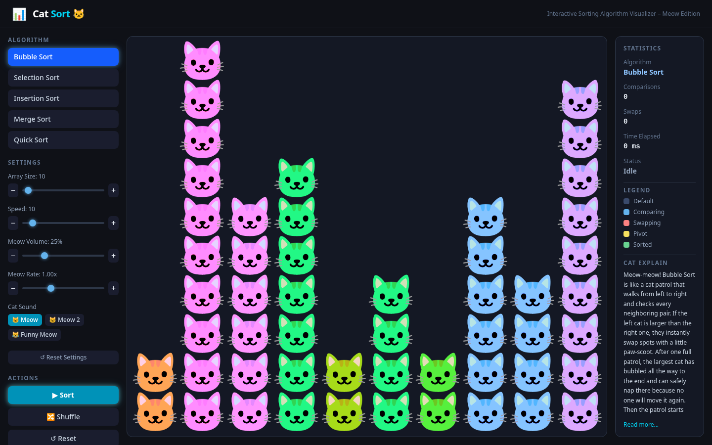

# Cat Sort 🐱

An interactive sorting algorithm visualizer – **Meow Edition**.

Sorting has never been cuter. Watch algorithms race through your data as columns of **stacked cat faces**, each with a unique expression depending on what the algorithm is doing – and listen to the **meow sounds** they make on every comparison and swap.



## Features

- **5 Algorithms** – Bubble Sort, Selection Sort, Insertion Sort, Merge Sort, Quick Sort
- **Cat-Face Bar Chart** – bars are stacked cat emoji whose expression changes with their state:
  - 🐱 Default, 😸 Comparing, 🙀 Swapping, 😼 Pivot, 😻 Sorted
- **Meow Audio Feedback** – every array access synthesises a pitch-shifted meow via the Web Audio API (higher values = higher-pitched meow)
- **Real-time Stats** – comparisons, swaps, elapsed time, and status
- **Controls** – array size slider (10–150), speed slider (1–100), Shuffle, Reset, Pause/Resume

## Tech Stack

| Layer | Technology |
|-------|-----------|
| Framework | React 19 + TypeScript |
| Build | Vite |
| Styling | Tailwind CSS v4 |

## Getting Started

```bash
npm install
npm run dev
```

Open [http://localhost:5173](http://localhost:5173) in your browser.

## Build

```bash
npm run build
```
